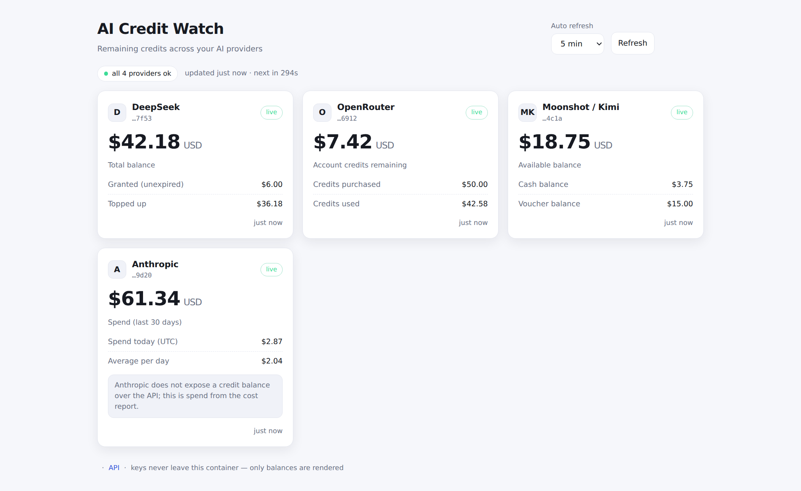

# AI Credit Watch

[](https://github.com/abdulazizalmalki-gh/ai-credit-watch/actions/workflows/build-and-publish.yml)
[](https://github.com/abdulazizalmalki-gh/ai-credit-watch/pkgs/container/ai-credit-watch)
[](https://github.com/abdulazizalmalki-gh/ai-credit-watch/blob/main/LICENSE)

A tiny self-hosted dashboard that shows how much credit you have left with your AI
providers. One container, no database, no accounts, no telemetry — you drop your
API keys in, and it renders the numbers.



*(Sample data — the numbers above are made up, not anyone's account.)*

Currently ships with:

| Provider | Endpoint used | What it shows |
| --- | --- | --- |
| **DeepSeek** | `GET /user/balance` | total balance, granted vs. topped-up, per currency |
| **OpenRouter** | `GET /api/v1/key`, `GET /api/v1/credits` | account credits remaining (management key), per-key limit/usage, daily/weekly/monthly spend |
| **OpenAI** | `GET /organization/costs`, `GET /organization/usage/completions` | spend for the last 30 days and today, average per day, plus tokens and model requests — *admin key only, and admin keys cannot read `/v1/models` (a plain project key gets an explanatory card instead)* |
| **Moonshot / Kimi** | `GET /v1/users/me/balance` | available balance (= cash + voucher), cash and voucher separately; region-bound keys (`.ai` USD / `.cn` CNY) are auto-detected — no admin key needed |
| **Anthropic** | `GET /organizations/cost_report`, `GET /organizations/usage_report/messages` | spend for the last 30 days and today, average per day, tokens and cache reads/writes (cost arrives in cents) — *needs an admin credential* |

Adding a provider is one ~40-line file (see [Adding a provider](#adding-a-provider)).

```
┌──────────────────────────┐        ┌──────────────────────────┐
│ DeepSeek        ● live   │        │ OpenRouter      ● live   │
│ $42.00 USD               │        │ $75.00 USD               │
│ Total balance            │        │ Account credits remaining │
│ Granted (unexpired) $0.00│        │ Credits purchased  $100.00│
│ Topped up         $42.00 │        │ Credits used        $25.00│
└──────────────────────────┘        └──────────────────────────┘
```

## Quick start

Three ways to run it. **Pick one** — they are alternatives, not steps to run in order
(each one publishes the same container on the same host port, so running two at once just
collides).

### 1. docker compose (recommended)

```bash
git clone https://github.com/abdulazizalmalki-gh/ai-credit-watch.git
cd ai-credit-watch
cp .env.example .env      # put your provider keys here
docker compose up -d
```

Compose publishes the dashboard on whatever `CREDIT_WATCH_BIND` holds: `127.0.0.1`
(this host only) by default, or the host's LAN IP if you set it, which is what makes it
reachable from your phone or laptop:

```bash
# .env
DEEPSEEK_API_KEY=sk-...
CREDIT_WATCH_BIND=192.0.2.50     # this host's LAN IP (find it: ip -4 -o addr show scope global)
```

`0.0.0.0` is never used. Then open `http://127.0.0.1:8760`, or `http://192.0.2.50:8760`
from another device on that network.

Compose builds the image from this checkout by default. To run the published image
instead, add one line to `.env`:

```bash
CREDIT_WATCH_IMAGE=ghcr.io/abdulazizalmalki-gh/ai-credit-watch:latest
```

### 2. docker run (no compose, no checkout)

```bash
docker run -d \
  --name ai-credit-watch \
  -p 127.0.0.1:8760:8000 \
  -e DEEPSEEK_API_KEY=sk-... \
  -e OPENROUTER_API_KEY=sk-or-... \
  --restart unless-stopped \
  ghcr.io/abdulazizalmalki-gh/ai-credit-watch:latest
```

Use `-p 192.0.2.50:8760:8000` to publish on your LAN IP instead of loopback. Keys go on
the command line (or in a mounted keys file), so it is the least tidy option — but it needs
nothing except Docker.

### 3. ./run.sh (compose + automatic LAN binding)

The same container as option 1; the script just does the address bookkeeping for you:

```bash
git clone https://github.com/abdulazizalmalki-gh/ai-credit-watch.git
cd ai-credit-watch
cp .env.example .env      # add the provider keys you have
./run.sh                  # detects this host's LAN IP, stores it in .env, runs compose
```

It prints the URL to open — `http://<this-host-lan-ip>:8760`. Flags:

```bash
./run.sh --localhost         # publish on 127.0.0.1 only (this host)
./run.sh --bind 192.0.2.51   # publish on a specific address
./run.sh --port 9000         # different host port
```

`run.sh` refuses `0.0.0.0`, writes only the bind/port lines into `.env` (your keys are left
alone), and falls back to `127.0.0.1` with a warning if it cannot detect a LAN address —
pass `--bind` in that case.

All three are configured the same way, through `.env` or environment variables — see
[Configuration](#configuration). Keys are explained next.

## Where the keys go

Three options, checked in this order:

1. **Environment variables** — `DEEPSEEK_API_KEY`, `OPENROUTER_API_KEY` (this is what `docker run -e` / `env_file` sets).
2. **A keys file** — `KEY=value` lines, no quotes needed. `KEYS_FILE=/run/secrets/credit-watch.env`, or drop `keys.env` / `.env` next to the app. Handy with Docker secrets:
   ```yaml
   services:
     credit-watch:
       secrets: [credit-watch-keys]
   secrets:
     credit-watch-keys:
       file: ./credit-watch-keys.env
   ```
3. **A mounted `.env`** — the compose file already loads `./.env`.

Provider keys never reach the browser: the JSON API only ever returns a masked hint
(`…1234`). The page is a plain HTML/JS bundle with zero third-party requests.

## LAN access

The default is `127.0.0.1` — this host only. To reach the dashboard from your phone,
laptop, or another box on the network, publish it on the host's LAN address instead — one
of the options from [Quick start](#quick-start):

- **compose** — set `CREDIT_WATCH_BIND=<lan-ip>` in `.env`
- **docker run** — use `-p <lan-ip>:8760:8000`
- **run.sh** — does it for you automatically

Bind the one interface you actually want; never `0.0.0.0`.

```bash
ip -4 -o addr show scope global        # e.g. eth0  192.0.2.50/24
```

Then browse to `http://192.0.2.50:8760`.

Inside the container uvicorn listens on all of *its own* network namespace (you will see
`Uvicorn running on http://0.0.0.0:8000` in the logs) — that is container-internal. Host
exposure is exactly what you published above, nothing more.

**Anyone who can reach that port can read your balances**, so enable the built-in auth
when the port is more than local:

```bash
BASIC_AUTH_USER=you
BASIC_AUTH_PASSWORD=<something long>
```

The dashboard then prompts for a password while `/healthz` stays open for the container
healthcheck. If the page is still unreachable from the other device, it is usually the
host firewall:

```bash
sudo ufw status
sudo ufw allow from 192.0.2.0/24 to any port 8760 proto tcp
```

Prefer not to expose it at all? Run `tailscale` (or an SSH tunnel:
`ssh -L 8760:127.0.0.1:8760 host`) and leave `CREDIT_WATCH_BIND` at `127.0.0.1`.

## Configuration

| Variable | Default | Purpose |
| --- | --- | --- |
| `DEEPSEEK_API_KEY` | — | DeepSeek platform key |
| `OPENROUTER_API_KEY` | — | OpenRouter key (management key for account credits) |
| `OPENAI_ADMIN_KEY` / `OPENAI_API_KEY` | — | OpenAI key; an `sk-admin-…` key is needed for spend |
| `OPENAI_COST_WINDOW_DAYS` | `30` | Days of OpenAI spend to summarise (max 180) |
| `ANTHROPIC_ADMIN_KEY` / `ANTHROPIC_API_KEY` | — | Anthropic key; billing needs an `sk-ant-admin01-…` credential |
| `ANTHROPIC_COST_WINDOW_DAYS` | `30` | Days of Anthropic spend to summarise (cost report caps at 31) |
| `MOONSHOT_API_KEY` / `KIMI_API_KEY` | — | Moonshot (Kimi) key; plain keys read their own balance |
| `MOONSHOT_REGION` | `international` | `china` switches to `api.moonshot.cn` (CNY billing) |
| `CREDIT_WATCH_BIND` | `127.0.0.1` | Host interface to publish on. Set it to the host's LAN IP for LAN access (never `0.0.0.0`) |
| `CREDIT_WATCH_PORT` | `8760` | Host port, published on `CREDIT_WATCH_BIND` |
| `SHOW_UNCONFIGURED` | `false` | Show a placeholder card for providers with no key (default: just a footer note) |
| `CACHE_TTL_SECONDS` | `60` | How long provider responses are cached |
| `HTTP_TIMEOUT_SECONDS` | `15` | Per-request timeout for provider APIs |
| `REFRESH_MIN_INTERVAL_SECONDS` | `10` | Minimum gap between one client's upstream refreshes (`0` disables) |
| `REFRESH_MAX_PER_MINUTE` | `20` | Cap on upstream refreshes per minute across all clients (`0` disables) |
| `BASIC_AUTH_USER` / `BASIC_AUTH_PASSWORD` | — | Enable HTTP Basic auth (`/healthz` stays open) |
| `KEYS_FILE` | `/run/secrets/credit-watch.env` | Extra keys file to read |
| `APP_TITLE` | `AI Credit Watch` | Page title |
| `DEEPSEEK_API_BASE` / `OPENROUTER_API_BASE` | provider defaults | Point a provider at a proxy/gateway |

## HTTP API

| Route | Description |
| --- | --- |
| `GET /` | the dashboard |
| `GET /api/balances?refresh=true` | current balances for every configured provider (JSON) |
| `GET /api/providers` | catalog: provider metadata, env var names, whether a key is set |
| `GET /healthz` | liveness (used by the container healthcheck) |
| `GET /api/docs` | OpenAPI UI |

Example response shape (`/api/balances`):

```json
{
  "updated_at": "2026-09-21T00:12:04+00:00",
  "cached": false,
  "duration_ms": 210,
  "providers": [
    {
      "id": "deepseek",
      "name": "DeepSeek",
      "configured": true,
      "key_hint": "…1234",
      "status": "ok",
      "ok": true,
      "balances": [
        {"label": "Total balance", "amount": 42.0, "currency": "USD", "kind": "balance", "primary": true}
      ],
      "meta": {"usable": true},
      "fetched_at": "2026-09-21T00:12:04+00:00"
    }
  ]
}
```

A provider that is unreachable, rate limited or missing a key never takes the page
down: it comes back as `status: "error"` (or `"unconfigured"`) with the reason in
`error`, next to the other providers' live numbers.

## Refresh abuse protection

Every `refresh=true` request — and any read that cannot be served from cache — costs a
provider API call, so those calls are budgeted:

- one upstream refresh per client per `REFRESH_MIN_INTERVAL_SECONDS` (default 10)
- at most `REFRESH_MAX_PER_MINUTE` upstream refreshes per minute in total (default 20),
  which protects provider quotas even when several people have the page open

Cached reads are free and never limited: a page load, the auto-refresh timer, extra tabs
and reloads all cost nothing. When a client asks too often the API answers:

```http
HTTP/1.1 429 Too Many Requests
Retry-After: 8

{"detail": "Refresh rate limit reached — try again shortly.", "retry_after": 8,
 "refresh_min_interval_seconds": 10, "refresh_max_per_minute": 20}
```

The page honours that: the Refresh button disables itself with a live `retry in Ns`
countdown beside it, a 429 parks it for exactly the server's `retry_after`, the
auto-refresh timer waits the cooldown out, and a double-click or the `r` key cannot queue
a second request while one is in flight. `X-Forwarded-For` is only trusted when the
direct peer is loopback (what uvicorn's `--proxy-headers` does by default), so a client
cannot spoof its way around the per-client budget.

Set `REFRESH_MIN_INTERVAL_SECONDS=0` and `REFRESH_MAX_PER_MINUTE=0` to switch it off.

## Adding a provider

1. Create `app/providers/<name>.py`.
2. Subclass `Provider`, set `id`, `name`, `env_keys`, links and `default_base_url`.
3. Implement `fetch()` returning a `ProviderResult`.

```python
# app/providers/example.py — illustrative: swap in a real documented endpoint
from __future__ import annotations

import httpx

from .base import Balance, Provider, ProviderResult, to_float


class ExampleProvider(Provider):
    id = "example"                     # unique; becomes the card's identity
    name = "Example"
    description = "What this provider reports."
    docs_url = "https://example.invalid/docs"      # where the endpoint is documented
    signup_url = "https://example.invalid/billing"  # where to add credit
    keys_url = "https://example.invalid/keys"       # where to create a key
    env_keys = ("EXAMPLE_ADMIN_KEY", "EXAMPLE_API_KEY")  # first non-empty wins
    default_base_url = "https://api.example.invalid/v1"
    base_url_env = "EXAMPLE_BASE_URL"  # optional override for proxies/gateways

    def auth_headers(self) -> dict[str, str]:  # override if not Bearer auth
        return {"Authorization": f"Bearer {self.api_key}", "Accept": "application/json"}

    async def fetch(self, client: httpx.AsyncClient) -> ProviderResult:
        try:
            response = await client.get(f"{self.base_url}/account/balance", headers=self.auth_headers())
        except httpx.HTTPError as exc:
            return ProviderResult(ok=False, error=f"Network error: {exc}")

        if response.status_code in (401, 403):
            return ProviderResult(ok=False, error="Unauthorized — the API key was rejected.")
        if response.status_code >= 400:
            return ProviderResult(ok=False, error=f"HTTP {response.status_code}: {response.text[:200]}")

        data = response.json()
        return ProviderResult(
            ok=True,
            balances=[
                Balance(label="Credit remaining", amount=to_float(data.get("balance")),
                        currency=data.get("currency", "USD"), primary=True),
            ],
            meta={"raw_keys": sorted(data)[:8]},
        )
```

Two of the shipped providers are worth reading before writing your own, because real
APIs are messier than the sketch above: `app/providers/openai.py` (admin keys are refused
by `/v1/models`, so it asks for costs first and uses models only to explain a failure) and
`app/providers/anthropic.py` (auth is `x-api-key` + `anthropic-version`, and cost arrives
as decimal strings in cents).


The module is discovered automatically — restart the container and the card appears
(or is listed as "not configured" with a hint for the env var to set). No registry to
edit, no frontend changes: the UI renders whatever `balances` you return, with
`primary=True` picking the headline number.

## Security notes

- Published on `127.0.0.1` by default. If you expose it beyond the host, put it
  behind a reverse proxy **and** set `BASIC_AUTH_USER` / `BASIC_AUTH_PASSWORD`
  (or Cloudflare Access / Authelia — the app is happy to sit behind either).
- The container runs as an unprivileged uid (10001), read-only root filesystem,
  all capabilities dropped, `no-new-privileges`.
- Keys are read once per request from the environment/keys file and are never
  logged, cached to disk, or returned by the API.
- Only outbound HTTPS to the provider APIs is made — no telemetry, no analytics,
  no external assets in the frontend.

## Development

```bash
# tests (no network, httpx MockTransport) — same command CI runs
docker build --target test -t ai-credit-watch:test .

# or on the host
python3 -m venv .venv && . .venv/bin/activate
pip install -r requirements.txt -r requirements-dev.txt
python -m pytest

# run locally
uvicorn app.main:app --reload --port 8000

# optional: render the page headlessly against a running instance, no browser and
# no npm dependencies (node only) — prints the card tree it would paint
PORT=8760 node dev/render-check.js
node dev/render-check.js --url http://<host-lan-ip>:8760   # a deployed instance
node dev/render-check.js --rate-limited                    # asserts the 429 handling
node dev/render-check.js payload.json                      # replay a saved response

# install the repo's git hooks — a pre-push privacy sweep that aborts a leaky push
./dev/install-hooks.sh

# run the sweep by hand whenever you like (tree + full history + commit metadata)
./dev/privacy-sweep.sh
./dev/privacy-sweep.sh --staged                          # pre-commit style check
./dev/privacy-sweep.sh --image ai-credit-watch:latest    # also grep a built image
```

CI (`.github/workflows/build-and-publish.yml`) runs the test stage on every push and
PR, then builds and pushes `linux/amd64` + `linux/arm64` images to GHCR on `main`
(tags: `latest`, `sha-<commit>`) and on `v*` tags (semver), with SBOM + provenance
attestations, plus a smoke test that boots the image and hits `/healthz`.

## License

MIT — see [LICENSE](LICENSE).
